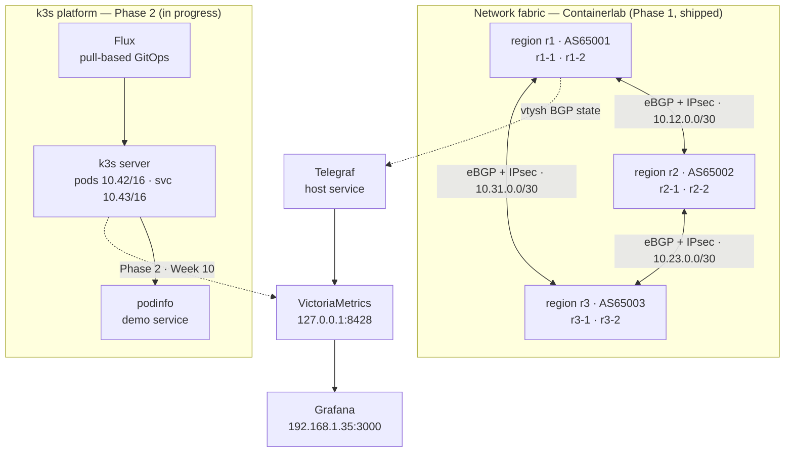

# sparebox

A single bare-metal NixOS box running two halves of an SRE stack: a simulated
three-region network fabric (FRR, BGP/OSPF, IPsec, MPLS VPNv4) and a GitOps-managed
k3s platform — with one `flake.nix` as the source of truth for both, and measured
failure behaviour rather than asserted failure behaviour.

Phase 1 (network fabric) is complete and reproducible from a cold deploy.
Phase 2 (k3s platform) is in progress.

---

## Architecture



Full detail, including addressing and protocol-domain boundaries, is in
[`docs/architecture.md`](docs/architecture.md).

---

## Quickstart

```bash
# host
sudo nixos-rebuild switch --flake .#sparebox

# network fabric
sudo containerlab deploy -t containerlab/topology.clab.yml
sudo ./containerlab/scripts/setup-cust-a.sh
```

Never use bare `nixos-rebuild switch` on this host — see
[`docs/runbook.md`](docs/runbook.md) for why.

---

## Repo layout

```
flake.nix                     single source of truth for the host
modules/                      NixOS modules (boot, networking, docker, k3s, observability…)
containerlab/
  topology.clab.yml           3-region, 6-router fabric definition
  frr/                        per-router FRR config (committed, not generated)
  strongswan/                 IPsec sidecar config + image
  scripts/                    post-deploy kernel setup, metrics collectors
  chaos/                      fault injection, probing, trial runner, analyzer
  chaos/results/              formal benchmark evidence (CSV)
grafana/dashboards/           provisioned dashboards
docs/                         architecture, runbook, phase writeups, ADRs
postmortems/                  one per chaos game day (Phase 2)
```

---

## Measured results

All figures come from committed CSVs in `containerlab/chaos/results/` and are
reproducible with `containerlab/chaos/analyze.sh`.

**Failover convergence — 60 formal link-down trials across all three ring links**

| Metric | p50 | p95 |
|---|---:|---:|
| Route-change detection | 54.6 ms | 90.6 ms |
| Route heal after repair | ~1.30 s | ~1.35 s |

Path change occurred in 60/60 trials, with 0% packet loss in 60/60 — the redundant
inter-region links absorbed the failure before any ICMP gap was observable.

**Blackhole — 20 formal trials on `link12`**

| Metric | p50 |
|---|---:|
| Loss interval | 5.107 s |
| Loss detection lag | 47 ms |

Zero route changes across all 20. This is the point of running blackhole separately
from link-down: a silently discarding path produces no link-state event, so the
control plane has nothing to react to until BGP timers expire. The two numbers
measure different failure modes and are deliberately never pooled into one
"convergence" figure.

**Tunnel overhead — strongSwan vs WireGuard, same endpoints**

| | Throughput | Avg RTT | Loss |
|---|---:|---:|---:|
| Baseline (no tunnel) | 27.48 Gbit/s | — | 0% |
| strongSwan (IKEv2/ESP) | 506.8 Mbit/s | 0.182 ms | 0% |
| WireGuard | 1.667 Gbit/s | 0.707 ms | 0% |

Lab measurements on a 6th-gen i5, not general protocol-performance claims.

**Control plane**

- 6/6 intra-region OSPF adjacencies `Full`
- 18/18 IPv4-unicast BGP sessions established (6 iBGP + 12 eBGP)
- Bilateral `CUST-A` VRF reachability resolving through an MPLS label

---

## What this is not

Stated explicitly because the difference matters in review:

- **Not** full red/blue Inter-AS Option B. The shipped VPNv4 milestone is a verified
  single-VRF `CUST-A` pilot on the r1 pair. The full design was attempted, hit real
  RT-export and cross-AS LDP problems, and was deliberately deferred rather than
  quietly dropped — see [ADR 0001](docs/decisions/0001-option-b-defer.md).
- **Not** a fabric-wide LDP domain. LDP is scoped to the r1 pair on purpose.
- **Not** full data-plane encryption. IPsec is transport mode on the three primary
  inter-region transit links.
- **Not** full fabric telemetry. The shipped collector is BGP peer state only —
  no OSPF, LDP, interface-counter or IPsec metrics yet.
- **Not** highly available. One box, one node, no failover partner. The recovery
  story is NixOS generation rollback, not redundancy.

---

## Documentation

| Document | What it covers |
|---|---|
| [`docs/architecture.md`](docs/architecture.md) | Addressing, protocol boundaries, host services, Phase 2 plan |
| [`docs/runbook.md`](docs/runbook.md) | Operational procedures, known traps, verification commands |
| [`docs/phase1-progress.md`](docs/phase1-progress.md) | Full Phase 1 build and verification log |
| [`docs/decisions/`](docs/decisions/) | Architecture decision records |
| [`postmortems/`](postmortems/) | Chaos game-day postmortems (Phase 2) |
